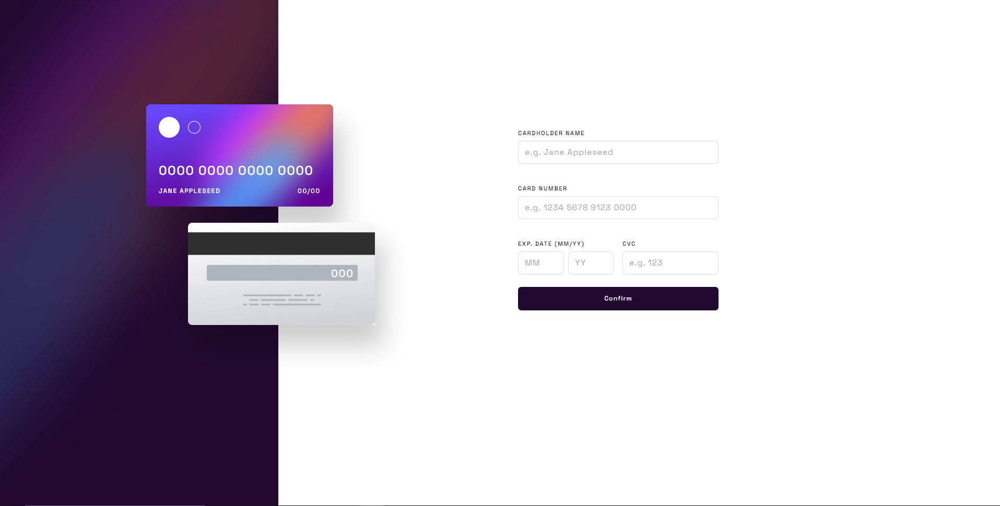

# Frontend Mentor - Interactive card details form solution

This is a solution to the [Interactive card details form challenge on Frontend Mentor](https://www.frontendmentor.io/challenges/interactive-card-details-form-XpS8cKZDWw). Frontend Mentor challenges help you improve your coding skills by building realistic projects.

## Table of contents

- [Overview](#overview)
  - [The challenge](#the-challenge)
  - [Screenshot](#screenshot)
  - [Links](#links)
- [My process](#my-process)
  - [Built with](#built-with)
  - [What I learned](#what-i-learned)
  - [Continued development](#continued-development)
- [Author](#author)

## Overview

### The challenge

Users should be able to:

- Fill in the form and see the card details update in real-time
- Receive error messages when the form is submitted if:
  - Any input field is empty
  - The card number, expiry date, or CVC fields are in the wrong format
- View the optimal layout depending on their device's screen size
- See hover, active, and focus states for interactive elements on the page

### The challenge

Users should be able to:

- Fill in the form and see the card details update in real-time
- Receive error messages when the form is submitted if:
  - Any input field is empty
  - The card number, expiry date, or CVC fields are in the wrong format
- View the optimal layout depending on their device's screen size
- See hover, active, and focus states for interactive elements on the page

### Screenshot

### Links

- Solution URL: [Add solution URL here](https://your-solution-url.com)
- Live Site URL: [Add live site URL here](https://your-live-site-url.com)

## My process

### Built with

- Semantic HTML5 markup
- CSS custom properties
- Flexbox
- Mobile-first workflow
- Sass
- javaScript

### What I learned

The initial idea that sprang to mind was to use both cards' absolute positions and their relative positions to body elements. I also tried to stack them in a container using the same positions, but in the end I realized that I would have to fight it out at every breakpoint.

I then made the decision to utilize flexbox to center the content of the body element. And then used flexbox inside that content to separate the cards and forms, and I used negative margins for both cards for alignment.

I visited Slack community to inquire about where to place those cards and whether or not to use position absolute. However, they are happy to offer guidance as to whether using negative margins or transforms is preferable. I then told myself that I was absolutely right about where I should place the cards 😂.

I picked up how to control two connected parts. The right parts (card) must be altered dynamically dependent on the user's input (the left card). But I can overcome such obstacles by coming up with a solution. However, the approach in which I put these solutions into practice still requires work.

### Continued development

These are the areas I need to concentrate on in my upcoming projects, thus I'm now focusing on javascript.

## Author

- Website - [Jovan Lanutan](https://portfolio-tan911.vercel.app/)
- frontendmento - [@tan](https://www.frontendmentor.io/profile/tan911)
